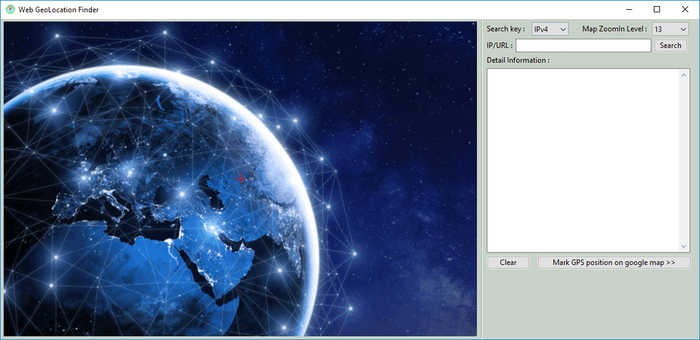
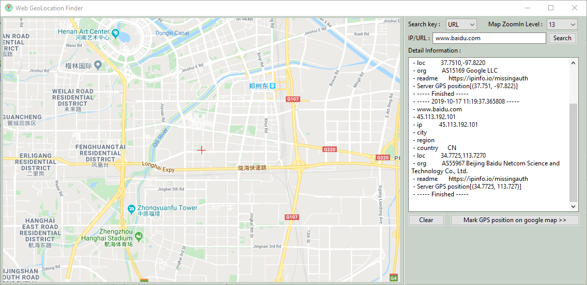
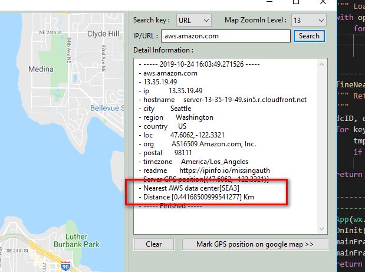

## IP/URL Geo-Location Checker
**Program Design Purpose**: We want to find the Geo-location Position of a IP Address or a Web URL's host server, then mark it on the map for visualization. We also want to find the nearest AWS data center around the position we marked.

[TOC]

#### Introduction 

This project will show the server/computer GPS position and related Geolocation information on the Google map based on the user typed in URL or IPv4 address. The user can also adjust the zoom in level and find the nearest AWS data center near the marked position. To check the detail of the checked geolocation, the program also provide the related function to open web browser and mark the position on google map.

**Program Work Flow:**

| This program will follow below steps to mark the server position on the map: |
| ------------------------------------------------------------ |
| Step 1 :  Parse URL to get the Web link. example ( https://pypi.org/project/wxPython/ ==> pypi.org ) |
| Step 2 : Convert web link to IPv4 address.                   |
| Step 3 : Call ipinfo.io API to convert the IP address to Geo-Location information.(GPS lat and lng) |
| Step 4 : Call Google Map API to download map Tiles based on the user’s image size and zoom in level setting. (Create the google map url link with the marked GPS position for user's further check.) |
| Step 5 : Combine all tiles to one map image, mark the server position and show the map in UI. |

###### Main Program UI View



Find Google's official DNS server position :


Version: v_0.1


------

#### Program Setup

###### Development Env: Python 3.7.10

###### Additional Lib need

1. wxPython 4.0.6 (build UI this lib need to be installed) : 

```
pip install -U wxPython 
```

​	link: https://wxpython.org/pages/downloads/index.html

2. pygeo : `pip install geopy`

link: https://pypi.org/project/geopy/

3. API to check IPv4 Address GPS/GeoLocation position: https://ipinfo.io/ (no need to install)

4. API to open browser and mark the position on Google map.(Google Chrome installed)

###### Hardware Needed : None

###### Program File List 

| Program File       | Execution Env | Description                                              |
| ------------------ | ------------- | -------------------------------------------------------- |
| src/geoLRun.py     | Python 3.7.10 | Main executable program.                                 |
| src/getLPanel.py   | Python 3.7.10 | UI panels module.                                        |
| src/geoGlobal.py   | Python 3.7.10 | local parameters config file.                            |
| src/awsRecord.txt  |               | AWS datacenter Geolocation and GPS position record file. |
| src awsAddress.txt |               | AWS datacenter address record file.                      |
| pdftxtExtrack.py   | Python3       | Convert AWS datacenter PDF file to a txt file.           |


------

#### Program Usage

**Program Execution Cmd:** 

```
python geoLRun.py
```

- The program support type in URL or the IP address. Then select the map zoom in level.(default is 13). 

- Copy the URL/IP address in the textField and press the 'Search' button.

- The Geo-Location information will show in the detail information textField. This the an example use the program to find the url "http://www.baidu.com" : 

  

- Press 'Mark GOS position on google map >> ' button the program will start the system default browser and mark the GPS position on the google map for user to do the further check. 

- Press the 'Clear' button will clear all the textField. 

- The Nearest AWS datacenter position and the distance between the AWS datacenter and the checked position will also shown in the textField:

  

- -- 

  

------

#### Problem and Solution

**Format:** 

**Problem**: (Situation description)

**OS Platform** :

**Error Message**:

**Type**: Setup exception

**Solution**:

**Related Reference**:

------

>  Last edit by LiuYuancheng(liu_yuan_cheng@hotmail.com) at 03/12/2021
